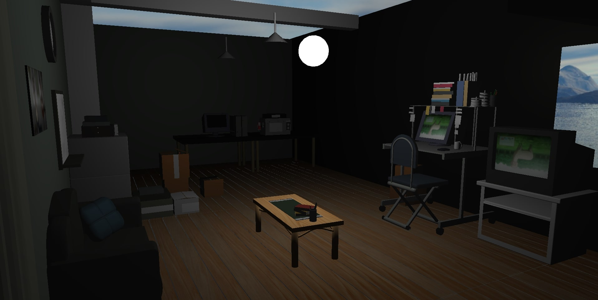
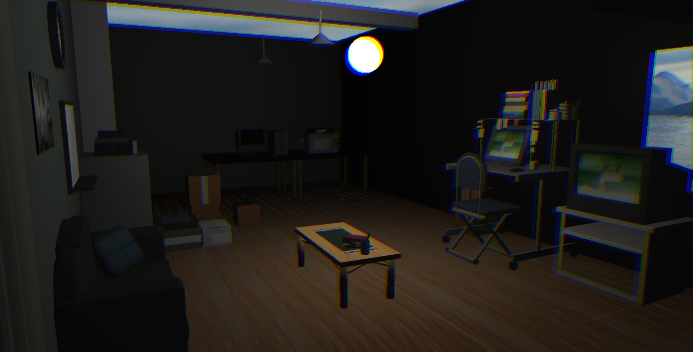

# CppOGL

## Description
A 3D Engine made in C++ and using the Opengl API,
mostly for learning purposes

## Installation

On linux in root folder:  

`chmod +x run.sh` to make the script executable

then `./run.sh`

> **Building assimp can take a long time**

## Visuals

## Usage

There is a GUI where you can interact with the scene, change models & lights position and disable or enable post processing effects
